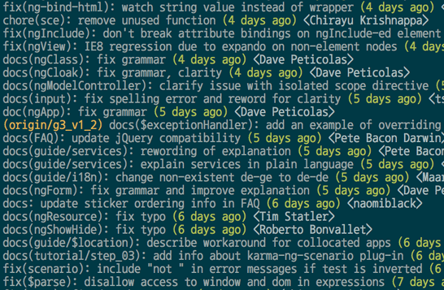
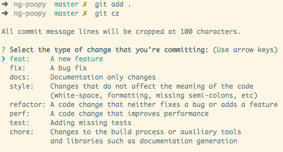

# Git Commit 提交信息指南

source: [angular CONTRIBUTING.md](https://github.com/angular/angular/blob/master/CONTRIBUTING.md)

- [husky](https://www.npmjs.com/package/husky) can prevent bad git commit, git push and more 🐶 woof!

## 提交代码流程

- 在新的分支中更改
  - `git checkout -b my-fix-branch release`
- 创建补丁patch，包括适当的测试用例 test cases
- 之后进行必要的更新，强制推送到远程
  - `git rebase master -i`
  - `git push -f`

**After your pull request is merged**

合并代码后，你可以删除本地分支，更新远程代码到本地

- git push origin --delete my-fix-branch
- git checkout release -f
- git branch -D my-fix-branch
- git pull --ff upstream master

## Commit Message 指南

Git 每次提交代码，都要写 Commit message（提交说明），否则就不允许提交。

```bash
git commit -m "hello world"
```

上面代码的 `-m` 参数，就是用来指定 commit mesage 的。

如果一行不够，可以只执行 `git commit`，就会跳出文本编辑器，让你写多行。

```bash
git commit
```

基本上，你写什么都行（[这里](http://www.commitlogsfromlastnight.com/)，[这里](http://blog.no-panic.at/2014/10/20/funny-initial-git-commit-messages/)和[这里](http://whatthecommit.com/)）。

但是，一般来说，commit message 应该清晰明了，说明本次提交的目的。


目前，社区有多种 Commit message 的[写法规范](https://github.com/ajoslin/conventional-changelog/blob/master/conventions)。本文介绍[Angular 规范](https://docs.google.com/document/d/1QrDFcIiPjSLDn3EL15IJygNPiHORgU1_OOAqWjiDU5Y/edit#heading=h.greljkmo14y0)（见上图），这是目前使用最广的写法，比较合理和系统化，并且有配套的工具。

### 一、Commit message 的作用

格式化的Commit message，有几个好处。

#### （1）提供更多的历史信息，方便快速浏览。

比如，下面的命令显示上次发布后的变动，每个commit占据一行。你只看行首，就知道某次 commit 的目的。

```bash
git log <last tag> HEAD --pretty=format:%s
```



#### （2）可以过滤某些commit（比如文档改动），便于快速查找信息。

比如，下面的命令仅仅显示本次发布新增加的功能。

```bash
git log <last release> HEAD --grep feature
```

#### （3）可以直接从 commit 生成 Change log。

Change Log 是发布新版本时，用来说明与上一个版本差异的文档，详见后文。


### 二、Commit message 的格式

每次提交，Commit message 都包括三个部分：Header，Body 和 Footer。

```bash
<type>(<scope>): <subject>
// 空一行
<body>
// 空一行
<footer>
```

其中，Header 是必需的，Body 和 Footer 可以省略。

不管是哪一个部分，任何一行都不得超过72个字符（或100个字符）。这是为了避免自动换行影响美观。

#### 2.1 Header

Header部分只有一行，包括三个字段：`type`（必需）、`scope`（可选）和 `subject`（必需）。

##### （1）type

`type` 用于说明 commit 的类别，**只允许**使用下面列出来的标识。

- build: 影响系统构建或外部依赖的修改(如: gulp, broccoli, npm)
- ci: 对CI配置文件和脚本的更改(如: Travis, Circle, BrowserStack, SauceLabs)
- docs: 仅仅是文档修改(documentation)
- feat: 新功能(A new feature)
- fix: 修补bug(A bug fix)
- perf: 优化代码提升性能
- refactor: 重构(既不是新增功能，也不是修改bug的代码变动)
- style: 格式变动(不影响代码含义或运行的修改)，如空格，尾分号等
- test: 添加缺失的测试或更正现有测试

如果 `type` 为 `feat` 和 `fix`，则该 commit 将肯定出现在 Change log 之中。其他情况（`build`、`ci`, `docs`、`style`、`refactor`、`test`）由你决定，要不要放入 Change log，建议是不要。

##### （2）scope

`scope` 用于说明 commit 影响的范围，比如数据层、控制层、视图层等等，视项目不同而不同。

- common
- compiler
- router
- service-worker
- upgrade

##### （3）subject

`subject` 是 commit 目的的简短描述，不超过50个字符。

- 以动词开头，使用第一人称现在时，比如 `change`，而不是 `changed` 或 `changes`
- 第一个字母小写
- 结尾不加句号（。）

#### 2.2 Body

Body 部分是对本次 commit 的详细描述，可以分成多行。下面是一个范例。

```code
More detailed explanatory text, if necessary.  Wrap it to
about 72 characters or so.

Further paragraphs come after blank lines.

- Bullet points are okay, too
- Use a hanging indent
```

::: tip 两个注意点

- 使用第一人称现在时，比如使用 `change` 而不是 `changed` 或 `changes`。
- 应该说明代码变动的动机，以及与以前行为的对比。

:::

#### 2.3 Footer

Footer 部分只用于两种情况。

##### （1）不兼容变动

如果当前代码与上一个版本不兼容，则 Footer 部分以 `BREAKING CHANGE` 开头，后面是对变动的描述、以及变动理由和迁移方法。

```code
BREAKING CHANGE: isolate scope bindings definition has changed.

  To migrate the code follow the example below:

  Before:

  scope: {
    myAttr: 'attribute',
  }

  After:

  scope: {
    myAttr: '@',
  }

  The removed `inject` wasn't generaly useful for directives so there should be no code using it.
```

##### （2）关闭 Issue

如果当前 commit 针对某个issue，那么可以在 Footer 部分关闭这个 issue 。

```code
Closes #234
```

也可以一次关闭多个 issue 。

```code
Closes #123, #245, #992
```

#### 2.4 Revert

还有一种特殊情况，如果当前 commit 用于撤销以前的 commit，则必须以 `revert:` 开头，后面跟着被撤销 Commit 的 Header。

```code
revert: feat(pencil): add 'graphiteWidth' option

This reverts commit 667ecc1654a317a13331b17617d973392f415f02.
```

Body部分的格式是固定的，必须写成 `This reverts commit <hash>`，其中的 `hash` 是被撤销 commit 的 SHA 标识符。

如果当前 commit 与被撤销的 commit，在同一个发布（release）里面，那么它们都不会出现在 Change log 里面。如果两者在不同的发布，那么当前 commit，会出现在 Change log 的 `Reverts` 小标题下面。

### 三、Commitizen

[Commitizen](https://github.com/commitizen/cz-cli) 是一个撰写合格 Commit message 的工具。

安装命令如下。

```bash
npm install -g commitizen
```

然后，在项目目录里，运行下面的命令，使其支持 Angular 的 Commit message 格式。

```bash
commitizen init cz-conventional-changelog --save
--save-exact
```

以后，凡是用到 `git commit` 命令，一律改为使用 `git cz`。这时，就会出现选项，用来生成符合格式的 Commit message。



### 四、validate-commit-msg

[validate-commit-msg](https://github.com/kentcdodds/validate-commit-msg) 用于检查 Node 项目的 Commit message 是否符合格式。

它的安装是手动的。首先，拷贝下面这个[JS文件](https://github.com/kentcdodds/validate-commit-msg/blob/master/index.js)，放入你的代码库。文件名可以取为`validate-commit-msg.js`。

接着，把这个脚本加入 Git 的 hook。下面是在 `package.json` 里面使用 [ghooks](http://npm.im/ghooks)，把这个脚本加为 `commit-msg` 时运行。

```js
"config": {
  "ghooks": {
    "commit-msg": "./validate-commit-msg.js"
  }
}
```

然后，每次git commit的时候，这个脚本就会自动检查 Commit message 是否合格。如果不合格，就会报错。

```bash
git add -A
git commit -m "edit markdown"

INVALID COMMIT MSG: does not match "<type>(<scope>): <subject>" ! was: edit markdown
```

## 生成 Change log

如果你的所有 Commit 都符合 Angular 格式，那么发布新版本时， Change log 就可以用脚本自动生成（[例1](https://github.com/ajoslin/conventional-changelog/blob/master/CHANGELOG.md)，[例2](https://github.com/karma-runner/karma/blob/master/CHANGELOG.md)，[例3](https://github.com/btford/grunt-conventional-changelog/blob/master/CHANGELOG.md)）。

生成的文档包括以下三个部分。

- New features
- Bug fixes
- Breaking changes.

每个部分都会罗列相关的 commit ，并且有指向这些 commit 的链接。当然，生成的文档允许手动修改，所以发布前，你还可以添加其他内容。

[conventional-changelog](https://github.com/ajoslin/conventional-changelog) 就是生成 Change log 的工具，运行下面的命令即可。

```bash
npm install -g conventional-changelog
cd my-project
conventional-changelog -p angular -i CHANGELOG.md -w
```

上面命令不会覆盖以前的 Change log，只会在CHANGELOG.md的头部加上自从上次发布以来的变动。

如果你想生成所有发布的 Change log，要改为运行下面的命令。

```bash
conventional-changelog -p angular -i CHANGELOG.md -w
-r 0
```

为了方便使用，可以将其写入 `package.json` 的 `scripts` 字段。

```js
{
  "scripts": {
    "changelog": "conventional-changelog -p angular -i CHANGELOG.md -w -r 0"
  }
}
```

以后，直接运行下面的命令即可。

```bash
npm run changelog
```

## 环境配置

配置好开发环境，使用时就如行云流水

你可以在 `pre-commit` 里面添加其他的脚本，比如单元测试(`ava`, `mocha`, `jasmine`...） 或者覆盖度测试(`nyc`, `istanbul`...)。 当然，在 `pre-commit` 的钩子里面添加的脚本越多，你的代码等待 `commit` 的时间也就越长。

安装依赖

```bash
sudo npm install -g commitizen cz-conventional-changelog
```

配置

```bash
echo '{ "path": "cz-conventional-changelog" }' > ~/.czrc
```

或 package.json 中添加 `config.commitizen`

``` js
"config": {
  "commitizen": {
    "path": "cz-conventional-changelog"
  }
}
```

其他配置 package.json

```js
"scripts": {
  "commit": "npx git-cz",
  "changelog": "node scripts/genChangelog.js run"
},
"gitHooks": {
  "pre-commit": "lint-staged",
  "commit-msg": "node scripts/verifyCommitMsg.js"
},
"lint-staged": {
  "*.{js, ts}": [
    "eslint --fix",
    "git add"
  ]
},
```

参考：

- [Commit message 和 Change log 编写指南](http://www.ruanyifeng.com/blog/2016/01/commit_message_change_log.html)
