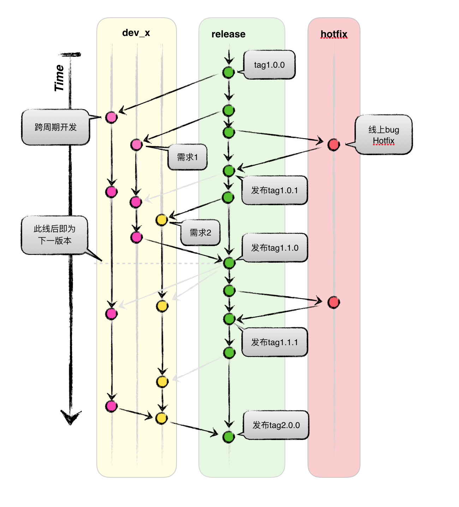

# Git

整理自 [https://github.com/webcoding/useGit](https://github.com/webcoding/useGit)

如果学习并测试 git 用法，可以使用示例 [Webtest](https://github.com/webcoding/webtest) 来测试学习。

## 常见问题

- 如何配置以及常见命令
- 修改commit 日志 git commit --amend
- 撤销提交，撤销前一次，前N次
- 删除远程分支
- 拉取一个本地不存在的远程分支到本地
- 合并分支，是否保留具体日志记录
- 如何绑定多个账号，如同时存在 github、gitlab 等账户

## 文档

Pro Git 2

- English [https://git-scm.com/book/en/v2](https://git-scm.com/book/en/v2)
- [**强烈推荐**]中文版 [https://git-scm.com/book/zh/v2/](https://git-scm.com/book/zh/v2/)

还可以参考一个比较全的教程
- [Git教程](https://www.liaoxuefeng.com/wiki/0013739516305929606dd18361248578c67b8067c8c017b000)
- [git-recipes](https://github.com/geeeeeeeeek/git-recipes/wiki)

## 安装

### 客户端 [GUI](https://www.git-scm.com/downloads/guis/)

推荐的客户端

- [**推荐**]命令行 [https://www.git-scm.com/download/](https://www.git-scm.com/download/)
- 图形化界面
  - Window - TortoiseGit [https://download.tortoisegit.org/tgit/](https://download.tortoisegit.org/tgit/)
  - Mac - Sourcetree [https://www.sourcetreeapp.com/](https://www.sourcetreeapp.com/)

## github操作指南

如果需要操作github，你可以参考

- [Git 与 github 操作指南](https://github.com/webcoding/useGit)
- [图形化软件TortoiseGit与github网站关联](https://github.com/webcoding/useGit#图形化软件tortoisegit与github网站关联)

## 多账号绑定问题

令不同 Host 实际映射到同一 HostName，但密钥文件不同。Host 前缀可自定义如xxx。配置文件 `.ssh/config`，

```conf
# default
Host github.com
HostName github.com
User git1
IdentityFile ~/.ssh/id_rsa

# two
Host gitlab.xxx.com
HostName gitlab.xxx.com
User git2
IdentityFile ~/.ssh/id_rsa_2

# three
Host xxx.github.com
HostName github.com
User git2
IdentityFile ~/.ssh/id_rsa_3
```

## 配置别名

为了操作更为简单便捷，可以配置别名

```conf
[alias]
  co = checkout
  ci = commit
  st = status
  br = branch
  lg = log --pretty=format:\"%h %ad | %s%d [%an]\" --graph --date=short
  type = cat-file -t
  dump = cat-file -p
  mg = merge --no-ff
```

## 常用命令

- [**推荐**][Git 命令清单](http://www.ruanyifeng.com/blog/2015/12/git-cheat-sheet.html)以下有整理
- Git 常用命令图表——[思维导图-Git.png](http://pic002.cnblogs.com/img/1-2-3/201007/2010072023345292.png)
- [Git远程操作详解](http://www.ruanyifeng.com/blog/2014/06/git_remote.html)

一般掌握下图的概念以及这几个命令，普通操作够用了


图：阮一峰

你必须要了解的概念：

- Workspace：工作区
- Index / Stage：暂存区
- Repository：仓库区（或本地仓库）
- Remote：远程仓库

最常用的命令

```bash
git clone/fetch <url>
git add .
git checkout .
git commit -am 'some msg'
git pull <url>
git push
git branch [-b] <branch>
```

而要熟练使用，就要掌握更多的命令

```bash
git clone <url>
git config --list
git config [--global] user.name "[name]"
git config [--global] user.email "[email address]"
git config [--global] alias.st status

git add xxx.file
git commit -am 'file msg'
git commit --amend

git branch
git branch -r
git branch <new-branch> <commit>
git checkout -b <new-branch>
git checkout <branch>
git checkout -

git merge <branch>

git branch -d <branch>
git branch -dr <remote/branch>
git push origin --delete <remote-branch>

git tag
git tag [tag] [commit]
git tag -d <tag>
git push origin :refs/tags/<tag>
git show <tag>
git push --tags
git checkout -b <new-branch> [tag]

git status
git diff
git reflog

git fetch/pull [url] [remote] [branch]
git push

git checkout <xxx.file>
git reset [--hard] HEAD
git reset <commit>
git revert
# https://github.com/geeeeeeeeek/git-recipes/wiki/5.2-%E4%BB%A3%E7%A0%81%E5%9B%9E%E6%BB%9A%EF%BC%9AReset%E3%80%81Checkout%E3%80%81Revert-%E7%9A%84%E9%80%89%E6%8B%A9

git stash
git stash list
git stash pop
git stash clear
```

## 关于 `HEAD^` `HEAD~` 和 `HEAD@{2}`

首先，Git 提交可以有多个父级，使用 `^` 你可以找到任何提交的父级，而不仅仅是HEAD。你也可以追溯到几代人，使用 `~`。

- HEAD^ 表示当前分支的提交的第一个父级，是 HEAD^1 的缩写
- HEAD~ 意味着主分支的祖父母，在歧义的情况下支持第一个父母
- 这些说明符可以被任意连接，例如，topic~3^2。
- 而HEAD@{}变量捕获HEAD运动的历史，用于git reflog或git stash list

为了有一个直观的表示，让我们引用[文档](http://schacon.github.io/git/git-rev-parse#_specifying_revisions)的一部分：

> 以下是Jon Loeliger的插图。
> 提交节点B和C都是提交节点A的父节点。父提交从左到右排序。

```code
G   H   I   J
 \ /     \ /
  D   E   F
   \  |  / \
    \ | /   |
     \|/    |
      B     C
       \   /
        \ /
         A

A =      = A^0
B = A^   = A^1     = A~1
C = A^2  = A^2
D = A^^  = A^1^1   = A~2
E = B^2  = A^^2
F = B^3  = A^^3
G = A^^^ = A^1^1^1 = A~3
H = D^2  = B^^2    = A^^^2  = A~2^2
I = F^   = B^3^    = A^^3^
J = F^2  = B^3^2   = A^^3^2
```

## 工作流

工作流英文名称叫做“workflow”，高效的工作流能像流水一样让这个工作体验顺畅且自然。

所以制定一套规范有效的git工作流来规范我们的分支管理和工作流程是极其必要的，并且越早越好。

我们的工作流，请使用下面的规范流程



### Git 使用规范流程

[Git 使用规范流程](http://www.ruanyifeng.com/blog/2015/08/git-use-process.html) 团队开发中，遵循一个合理、清晰的Git使用流程，是非常重要的。

1. 新建分支
    ```bash
    # 每次开发新功能，都应该新建一个单独的分支，可参考[Git分支管理策略]()
    $ git checkout release
    $ git pull
    $ git checkout -b dev_xxx
    ```
2. 提交分支commit
    ```bash
    # 分支修改后，就可以提交commit了
    $ git add .
    $ git status

    # verbose参数，会列出 diff 的结果
    $ git commit --verbose
    ```
3. 撰写提交信息
    提交commit时，必须给出完整扼要的提交信息，下面是一个范本。
    ```commit
    第一行是不超过50个字的提要，然后空一行

    * 罗列出改动原因，
    * 主要变动，
    * 以及需要注意的问题

    最后，提供对应的网址（比如Bug ticket）。
    ```
4. 与主干同步
    ```bash
    # 以下操作方式待定
    # 分支的开发过程中，要经常与主干保持同步
    $ git fetch origin
    # 或
    $ git rebase origin/master
    ```
5. 合并commit
    ```bash
    # 以下操作待定!!! 合并暂定为 git merge --no-ff
    # 分支开发完成后，很可能有一堆commit，但是合并到主干的时候，往往希望只有一个（或最多两三个）commit，这样不仅清晰，也容易管理。
    # 那么，怎样才能将多个commit合并呢？这就要用到 git rebase 命令。

    $ git rebase -i origin/master

    # i参数表示互动（interactive），这时git会打开一个互动界面，进行下一步操作。
    - pick：正常选中
    - reword：选中，并且修改提交信息；
    - edit：选中，rebase时会暂停，允许你修改这个commit
    - squash：选中，会将当前commit与上一个commit合并
    - fixup：与squash相同，但不会保存当前commit的提交信息
    - exec：执行其他shell命令
    ```
6. 推送到远程仓库
    ```bash
    # 合并commit后，就可以推送当前分支到远程仓库了
    $ git push
    # 不要使用 --force
    $ git push --force origin
    ```
7. 发出Pull Request
    ```bash
    # 提交到远程仓库以后，就可以发出 Pull Request 到发布分支release，
    # 然后请求别人进行代码review，确认可以合并到release
    $ git push
    ```
8. 至少两人code review，之后完成合并
9. 新增tag标签，发布上线

## 进阶

- [HEAD^ 与 HEAD~ 的区别](https://stackoverflow.com/questions/2221658/whats-the-difference-between-head-and-head-in-git)
- [图解4种git合并分支方法](http://yanhaijing.com/git/2017/07/14/four-method-for-git-merge/)
- [Git内部原理](http://yanhaijing.com/git/2017/02/08/deep-git-3/)
- [git --fixup & --autosquash](https://fle.github.io/git-tip-keep-your-branch-clean-with-fixup-and-autosquash.html)

其他参考：

- [Git 工作流程](http://www.ruanyifeng.com/blog/2015/12/git-workflow.html)
- [分布式-Git-分布式工作流程](https://git-scm.com/book/zh/v2/分布式-Git-分布式工作流程)
- [Git分支管理策略](http://www.ruanyifeng.com/blog/2012/07/git.html)
- [高效git工作流](https://juejin.im/post/5b2b76e251882574934c388d)
