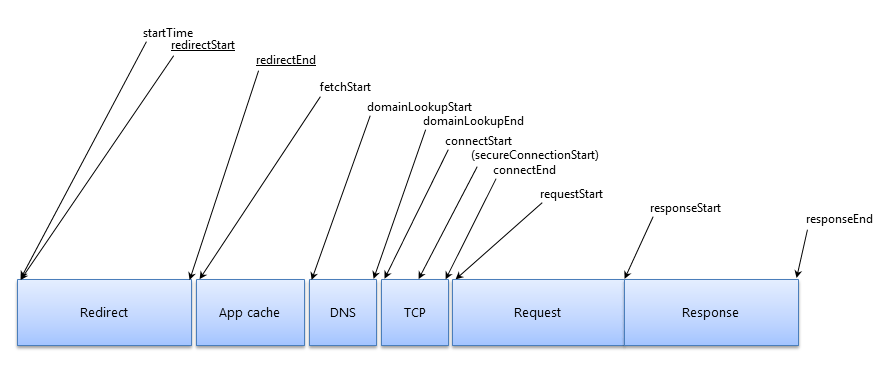

# 性能优化

TL;DR

此文主要参考以下内容：

- [chrome-devtools](https://developers.google.com/web/tools/chrome-devtools/)
- [performance](https://developers.google.com/web/fundamentals/performance/rail?hl=zh-cn)
- [H5性能优化方案](http://ddtalk.github.io/blog/2015/09/07/dingding-first/)
- [Navigation Timing](https://developers.google.com/web/fundamentals/performance/critical-rendering-path/measure-crp?hl=zh-cn)
- [Navigation Timing API](https://www.cnblogs.com/mrsunny/archive/2012/09/04/2670727.html)
- [了解 Resource Timing](https://developers.google.com/web/tools/chrome-devtools/network-performance/understanding-resource-timing)
- [打造亚秒级页面加载速度网店实践经验](http://www.infoq.com/cn/articles/practice-of-create-a-sub-page-loading-speed-shop)

## 用户感受

当用户能够在1-2秒内打开H5页面，看到信息的展示，或者能够开始进行下一步的操作，用户会感觉速度还好，可以接受；而页面如果在2-5秒后才进入可用的状态，用户的耐心会逐渐丧失；而如果一个界面超过5秒甚至更久才能显示出来，这对用户来说基本是无法忍受的，也许有一部分用户会退出重新进入，但更多的用户会直接放弃使用。

## 一秒钟法则

这是一张手机端接入服务器的流程。

首先，手机要通过无线网络协议，从基站获得无线链路分配，才能跟网络进行通讯。 无线网络基站、基站控制器这方面，会给手机进行信号的分配，已完成手机连接和交互。 获得无线链路后，会进行网络附着、加密、鉴权，核心网络会检查你是不是可以连接在这个网络上，是否开通套餐，是不是漫游等。核心网络有SGSN和GGSN，在这一步完成无线网络协议和有线以太网的协议转换。再下一步，核心网络会给你进行APN选择、IP分配、启动计费。 再往下面，才是传统网络的步骤：DNS查询、响应，建立TCP链接，HTTP GET，RTTP RESPONSE 200 OK，HTTP RESPONSE DATA，LAST HTTP RESPONSE DATA，开始UI展现。

可见，通过运营商的网络上网，情况比较复杂，经过的节点太多；运营商的网络信号强度变化频繁，连接状态切换快；网络延迟高、丢包率高；网络建立连接的代价高，传输速度快慢不等（从2G到4G，相差很大）。

而我们优化的目标，就是所谓的**一秒钟法则**，即达成以下的标准：

- 2g网络：1秒内完成dns查询、和后台服务器建立连接
- 3g网络：1秒内完成首字显示（首字时间）
- wifi网络：1秒内完成首屏显示（首屏时间）

## 优化方案

导航计时（[Navigation Timing](https://www.w3.org/TR/navigation-timing/)）

- 网络
  - DNS
- 域名/服务端部署
  - Gzip
  - 资源缓存，长cache
  - 分域名部署(静态资源域名)
  - 减少Cookie
  - CDN加速
- 资源加载性能
  - 性能（首字时间、首屏时间）
    - Navigation Timing 收集HTML文档的性能指标
    - [Resource Timing](https://developers.google.com/web/tools/chrome-devtools/network-performance/understanding-resource-timing) 收集文档相关资源性能指标，如CSS、JS、Image等
  - 优化
    - 首屏加载
    - 延迟加载Lazyload
    - 滚屏加载
    - Media Query（响应式加载）srcset
    - Loading进度条
    - 避免30*/40*/50*的http status
    - Favicon.ico
  - 图片
    - 格式选择 jpg vs webp, gif vs png8
      对于少量的图片，推荐用[智图](http://zhitu.isux.us/)或者[TinyPNG](http://www.tinypng.com/)等工具来帮助自己选择合适的大小、格式。
- 前端性能-关键渲染路径
  - 尽量使用事件代理,避免批量绑定事件
  - Html使用viewport
  - 减少dom节点
  - 合理使用requestAnimationFrame动画代替setTimeOut
  - tree shaking
- 代码规范
  - 避免空src
  - 避免空css规则
- 服务端接口
  - 接口合并
  - 减少接口数据量
  - 缓存
- 更快一步
  - 单页应用
  - 资源离线
  - 本地数据持久化和更新机制(版本管理)
  - 预加载

1. 后端处理（Backend）：网站服务器需要花时间从数据库载入数据并生成网页。
2. 网络延迟（Network latency）：每个请求需要花时间从客户端抵达服务器并再次返回客户端（请求延迟）。考虑到完整加载一个网站平均需要发出超过100个请求，延迟问题变得更严峻了。
3. 前端处理（Frontend）：前端设备渲染网页也需要时间。

前端性能

影响前端性能最重要的因素在于关键呈现路径（Critical Rendering Path，CRP）。这个概念描述了浏览器将网页呈现给用户的5个必要步骤，如下图所示。

根据以上接入流程，我们可以优化的阶段如下：

https://gtmetrix.com/analyze.html
https://www.webpagetest.org/
https://www.cnblogs.com/luozhihao/p/4681564.html

[window.performance.timing]

dns解析，tcp建链，服务器响应等

<!-- 
Network Timing API -->

- Queuing
  如果某个请求正在排队，则指示：
  - 请求已被渲染引擎推迟，因为该请求的优先级被视为低于关键资源（例如脚本/样式）的优先级。 图像经常发生这种情况。
  - 请求已被暂停，以等待将要释放的不可用 TCP 套接字。
  - 请求已被暂停，因为在 HTTP 1 上，浏览器仅允许每个源拥有六个 TCP 连接。
  - 生成磁盘缓存条目所用的时间（通常非常迅速）
- Stalled/Blocking
  请求等待发送所用的时间。 可以是等待 Queueing 中介绍的任何一个原因。 此外，此时间包含代理协商所用的任何时间。
- Proxy Negotiation
  与代理服务器连接协商所用的时间。
- DNS Lookup
  执行 DNS 查询所用的时间。 页面上的每一个新域都需要完整的往返才能执行 DNS 查询。
- Initial Connection / Connecting
  建立连接所用的时间，包括 TCP 握手/重试和协商 SSL 的时间。
- SSL
  完成 SSL 握手所用的时间。
- Request Sent / Sending
  发出网络请求所用的时间。 通常不到一毫秒。
- Waiting (TTFB)
  等待初始响应所用的时间，也称为至第一字节的时间。 此时间将捕捉到服务器往返的延迟时间，以及等待服务器传送响应所用的时间。
- Content Download / Downloading
  接收响应数据所用的时间。

#### 诊断网络问题

在 HTTP 1.0/1.1 连接上，Chrome 会将每个主机强制设置为最多六个 TCP 连接。

已被加入队列或已被停止的系列

要为传统的 HTTP 1 流量解决此问题，您需要实现**域分片**。也就是在您的应用上设置多个子域，以便提供资源。然后，在子域之间平均分配正在提供的资源。

HTTP 1 连接的修复结果**不会**应用到 HTTP 2 连接上。事实上，前者的结果会影响后者。 如果您部署了 HTTP 2，请不要对您的资源进行域分片，因为它与 HTTP 2 的操作方式相反。在 HTTP 2 中，到服务器的单个 TCP 连接作为多路复用连接。这消除了 HTTP 1 中的六个连接限制，并且可以通过单个连接同时传输多个资源。

至第一字节的漫长时间 又称：大片绿色

等待时间长表示至第一字节的时间 (TTFB) 漫长。建议将此值控制在 200 毫秒以下。长 TTFB 会揭示两个主要问题之一。

请执行以下任一操作：

客户端与服务器之间的网络条件较差，或者 2.服务器应用的响应慢
要解决长 TTFB，首先请尽可能缩减网络。理想的情况是将应用托管在本地，然后查看 TTFB 是否仍然很长。如果仍然很长，则需要优化应用的响应速度。可以是优化数据库查询、为特定部分的内容实现缓存，或者修改您的网络服务器配置。很多原因都可能导致后端缓慢。您需要调查您的软件并找出未满足您的性能预算的内容。

如果本地托管后 TTFB 仍然漫长，那么问题出在您的客户端与服务器之间的网络上。很多事情都可以阻止网络遍历。客户端与服务器之间有许多点，每个点都有其自己的连接限制并可能引发问题。测试时间是否缩短的最简单方法是将您的应用置于其他主机上，并查看 TTFB 是否有所改善。

达到吞吐量能力 又称：大片蓝色

如果您看到 Content Download 阶段花费了大量时间，则提高服务器响应或串联不会有任何帮助。首要的解决办法是减少发送的字节数。

https://zhuanlan.zhihu.com/p/23588780

什么是TTFB

TTFB（Time To First Byte）首字节时间，包含了发送请求到服务器，服务器处理请求并生成响应，服务器响应内容发送到浏览器的时间。只测试浏览器收到第一个字节的时间。这里的第一个字节不是内容，而是HTTP头的第一个字节。

网页加载时间节点

- First Byte 首字节
- Start Render，First Paint 开始渲染，白屏时间
- DOMContentLoaded 网页结构加载解析成DOM
- Load 网页加载完成，包括样式图片iframe等加载

- http://www.infoq.com/cn/news/2017/06/HTTP-Akamai-mobile
- http://www.infoq.com/cn/articles/practice-of-create-a-sub-page-loading-speed-shop

### 网络相关

### 资源加载

#### 首屏加载

### 图片的使用

webp & srcset

https://tinypng.com/

### 浏览器渲染性能

https://www.jianshu.com/p/a32b890c29b1

- 优化渲染性能

- http2
- 代码拆分
- 优化JavaScript的执行效率
- 图标方面，由于SVG是基于文本的图像格式，因此可以使用SVGO进行优化
- 压缩图像、webp、使用视频而不是gif（通常为后者大约 80％左右）
- NetworkInformation API（https://developer.mozilla.org/zh-CN/docs/Web/API/NetworkInformation）
requestAnimationFrame
  The NetworkInformation API exposes information about the user's network connection. This information can be used to modify application experiences for users on slower networks

### 服务器配置

### 代码规范

### 优化的方向

- http2
- preload

- https://yuchengkai.cn/docs/zh/frontend/performance.html
- http://ddtalk.github.io/blog/2015/09/07/dingding-first/
- https://github.com/amfe/article/issues/1

- https://www.jianshu.com/p/d857c3ff78d6

- https://segmentfault.com/a/1190000002511921
- https://juejin.im/entry/591da9f3570c350069831e58
- https://tech.jandou.com/h5-performance-optimization-scheme.html
- https://www.kancloud.cn/kancloud/h5-performance/48198
- https://blog.cnbang.net/tech/3477/
- https://cloud.tencent.com/developer/article/1042504

- http://www.browserscope.org/network/test

- http://www.alloyteam.com/2016/07/httphttp2-0spdyhttps-reading-this-is-enough/

http2

- https://www.ibm.com/developerworks/cn/web/wa-http2-under-the-hood/index.html
- https://zhuanlan.zhihu.com/p/29609078
- https://fed.renren.com/2017/05/20/websocket-and-tcp-ip/
- https://developers.google.com/web/fundamentals/performance/http2/?hl=zh-cn
