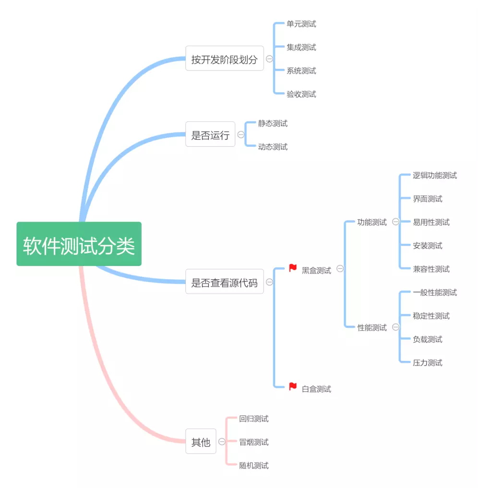

# 自动化测试

- [前端自动化测试探索](http://fex.baidu.com/blog/2015/07/front-end-test/)
- [虚拟座谈会：代码测试比率、测试驱动开发及行为驱动开发](http://www.infoq.com/cn/articles/virtual-panel-tdd-bdd)
- [TDD 与 BDD 仅仅是语言描述上的区别么？](https://www.zhihu.com/question/20161970)
- [关于TDD、BDD和DDD的一些看法](http://www.cnblogs.com/ustbwuyi/archive/2012/10/26/2741223.html)
- http://cuketest.com/zh-cn/

## 为什么需要自动化测试?

一个项目最终会经过快速迭代走向以维护为主的状态，在合理的时机以合理的方式引入自动化测试能有效减少人工维护成本。自动化测试的收益可以简单总结为：

> 自动化的收益 = 迭代次数 * 全手动执行成本 - 首次自动化成本 - 维护次数 * 维护成本

对于自动化测试来说，相对于发现未知的问题，更倾向于避免可能的问题。

## 测试方向

- **界面回归测试** 测试界面是否正常，这是前端测试最基础的环节
- **功能测试** 测试功能操作是否正常，由于涉及交互，这部分测试比界面测试会更复杂
- **性能测试** 页面性能越来越受到关注，并且性能需要在开发过程中持续关注，否则很容易随着业务迭代而下降。
- **页面特征检测** 有些动态区域无法通过界面对比进行测试、也没有功能上的异常，但可能不符合需求。例如性能测试中移动端大图素材检测就是一种特征检测，另外常见的还有页面区块静态资源是否符合预期等等。

## BDD vs TDD

测试类型可分为两种：TDD （测试驱动开发）和 BDD （行为驱动开发）,两者间的区别主要是一些语法上的不同，其中 BDD 提供了提供了可读性更好的用例语法，至于详细的区别可参见 [The Difference Between TDD and BDD](https://joshldavis.com/2013/05/27/difference-between-tdd-and-bdd/) 一文。

## 测试分类

- 单元测试 Unit Testing
  - 关注应用中每个零部件的正常运转，防止后续修改影响之前的组件。
  - jest 内置测试覆盖率工具 [istanbul](https://github.com/gotwarlost/istanbul) 开启使用参数 `jest --coverage`
  - 只关注代码覆盖率很可笑。关注在10%的风险最高的代码比关注99%可忽略风险的代码，收益要多得多。我认为风险覆盖比起测试覆盖要重要得多。
- 集成测试 Integrated Testing
  - 确保单独运行正常的零部件整合到一起之后依然能正常运行。
- 端到端测试/UI测试 e2e test
- 功能测试 Functional tests
  - 确保其整体表现符合预期，关注能否让用户正常使用。
- 系统测试 System Testing
- 验收测试
- 微测试
